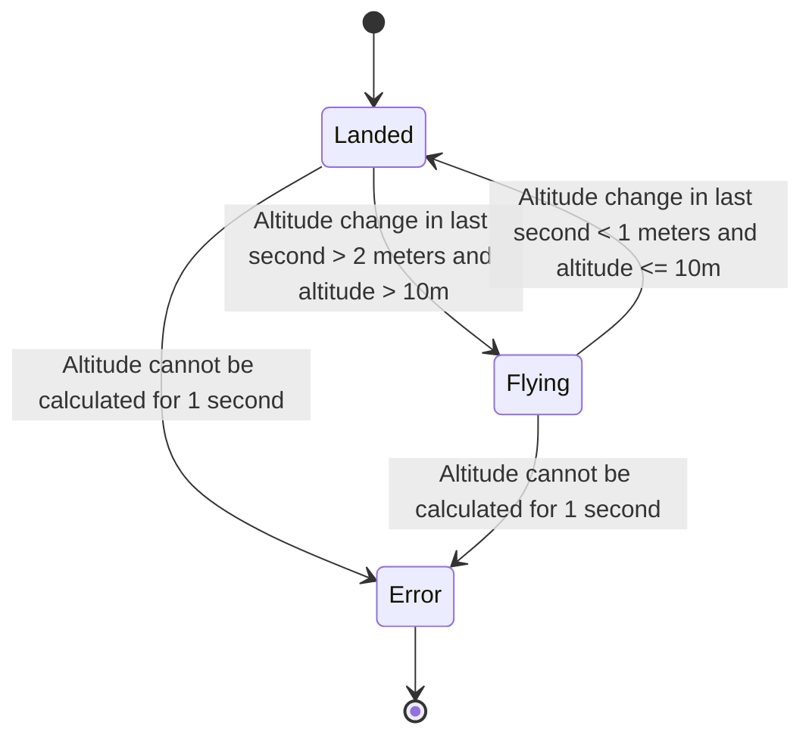

# Planning document for LAVA (lightweight avionics)

Harry Ganz

----

### V1
Feature Requirements
* After launch, display max altitude achieved

Functional requirements:
* Display data to OLED
* Read altitude from sensor
* Detect takeoff/landing

State Machine:

Initial Operations

1. Set state to LANDED
3. Create altitude buffer
3. Set max altitude to 0
2. Get average of 1s of altitude and store in initial alt. state. If cannot read for 1s, set state as ERROR
4. Set max altitude to 0

Loop:

1. Get current time in millis
2. Get current altitude and save to buffer
3. If LANDED:
   * Get altitude from 1s ago, change state to ERROR if cannot
   * If current altitude - altitude from 1s ago > 2 change state to FLYING
   * Else, display max altitude
